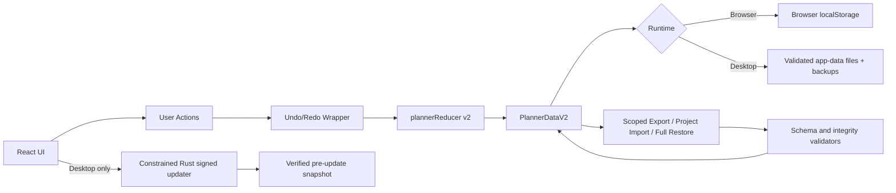

# Planner Buckets

Local-first planning board for projects, buckets, and tasks.

Planner Buckets supports both a browser application and a Windows desktop application built from the same React/Vite frontend and planner schema. No backend or account is required.

See [Project-native workspace workflows](docs/PROJECT_NATIVE_WORKSPACE.md) for board navigation, Quick Add, explicit selection, copy/export/import, Restore recovery, paste Undo, and the synthetic physical-acceptance checklist.

## Delivery modes

### Web application

The browser application remains fully supported.

- Planner data is stored in browser `localStorage`.
- JSON export, import, and Restore provide portability and backup options.
- Local development uses the commands in [Web quick start](#web-quick-start).

### Windows desktop application

The Windows application wraps the same frontend in Tauri 2 and builds a current-user NSIS installer.

- Planner data is stored in validated files under Tauri's runtime-resolved application-data directory, not in the Git checkout.
- Durable writes use verified replacement, recovery candidates, automatic routine and operation backups, writer exclusion, and corruption recovery.
- The Data panel reports the resolved planner and backup locations.
- Restore and Undo use durable native recovery snapshots.
- Normal close drains queued saves and blocks on an outstanding failed save.
- The signed updater is Rust-owned and opt-in: the user chooses **Check for updates** and, when an update is available, separately chooses **Install and restart**.
- Before updater installation begins, pending saves are flushed and a verified `pre-update` operation snapshot is created.

Issue #40 delivered durable desktop persistence and issue #41 delivered the signed updater/release infrastructure. Detailed desktop behavior is documented in [Desktop distribution](docs/DESKTOP.md); signed release procedures are in [Signed desktop releases](docs/RELEASES.md).

To move planner data from the browser to desktop, choose the **All data** export scope in the browser and **Restore** that raw full-planner file in the desktop application. Project, Bucket, and Unassigned exports are exchange files rather than complete backups; Restore refuses them and directs you to **Import project JSON**. Legacy raw v1/v2 backups remain compatible.

## Why this exists

Planner Buckets is designed for people who want:

- a fast visual planning surface;
- durable local workflows without account friction; and
- portable JSON data they can back up, audit, and move.

## Privacy and local data

Planner Buckets has no cloud account or backend.

- Browser mode stores planner data in browser `localStorage`.
- Desktop mode stores planner data and backups in the application's local application-data directory.
- Data stays on your machine unless you explicitly export, copy, or share it.
- Import, export, Restore, clipboard actions, and updater installation are user-triggered.
- Local planner data and backups are not claimed to be encrypted at rest. Do not store credentials or secrets in task text.

Use **Export All data** for an external backup before destructive maintenance, release acceptance, or moving between environments.

## Gallery


## Features

Project and board management:

- Multiple projects with pinned ordering
- Bucket columns with drag-and-drop bucket reordering
- Permanent Unassigned lane for unbucketed tasks
- Pin buckets into the left group for stable triage workflows
- Two-axis board navigation with persistent 70%-110% zoom
- Quick Add targeting an existing or new project and bucket

Task workflow:

- Create, edit, delete, pin, and complete tasks
- Drag-and-drop task ordering within and across buckets
- Explicit task and whole-bucket selection, separate from completion
- Copy selected tasks and paste into target buckets with a latest-batch Keep/Undo notice
- Search by task title and description

Template workflow:

- Reusable bucket templates and template definitions
- Apply templates to projects without manual bucket creation
- Shared bucket view aggregates bucket definitions across projects

Data and safety controls:

- Readable project Markdown and structured bucket JSON copy
- Raw All-data backups plus scope-tagged Project, Bucket, and Unassigned JSON exchange exports
- Explicit source and destination choices for project import
- Full-planner Restore with confirmation, pre-replacement recovery snapshot, operation-specific Undo, and scoped-exchange rejection
- Desktop automatic backups, safe replacement, recovery diagnostics, Retry save, and corruption preservation
- Undo/redo history around reducer actions

UX controls:

- Sidepanel with manual show/hide and lock behavior
- Board zoom controls with persistence
- Horizontal edge autoscroll while dragging tasks or buckets on wide boards
- Visual modes (Calm, Balanced, Energetic)
- Light and dark themes

## Web quick start

Requirements:

- Node.js 20.19+, 22.12+, or 24.x as permitted by the package engine range. Maintained CI and release validation use Node 22.

```bash
npm ci
npm run dev
```

Then open <http://localhost:5173>.

## Windows web-development start script

Use either:

- `start-local.cmd`
- `powershell -NoProfile -ExecutionPolicy Bypass -File .\scripts\start-local.ps1`

These scripts start the web development server from a checkout. They are not desktop installers.

## Testing and quality

Core checks:

```bash
npm test
npm run verify
npm run build
```

`npm run verify` runs the static release contract, test suite, TypeScript compilation, and Vite production build. Maintained hosted CI uses Node 22 and separately validates the Rust shell and Windows NSIS packaging.

## Desktop development and installation

The Windows shell targets Windows 10 version 1803 or later and Windows 11 with Microsoft Edge WebView2 available. Building it requires maintained Node.js 22/24, Rust stable with the `x86_64-pc-windows-msvc` host, Microsoft C++ Build Tools with **Desktop development with C++**, and WebView2.

```bash
npm run desktop:dev
npm run desktop:build
```

`npm run desktop:build` produces an NSIS installer under `src-tauri\target\release\bundle\nsis\`; generated build output is not committed. Hosted CI retains exact installer candidates with SHA-256 and provenance for acceptance. See [Desktop distribution](docs/DESKTOP.md) for the storage, lifecycle, updater, and installer contracts.

## Architecture (v2)

The application uses the v2 data model (`PlannerDataV2`) with explicit projects, buckets, tasks, templates, and template definitions.



v2 notes:

- Migration from v1 to v2 is built into persistence loading.
- Integrity validators enforce relational consistency across projects, buckets, tasks, templates, and template definitions.
- Browser storage uses versioned localStorage keys.
- Desktop storage uses the shared schema with native safe-write/recovery semantics and keeps legacy WebView data only as preserved migration evidence.

## Repository map

- `src/App.tsx`: primary composition, controls, and UI wiring
- `src/state/plannerReducerV2.ts`: deterministic state transitions
- `src/services/plannerPersistence.ts`: browser v1/v2 loading and migration
- `src/storage/`: runtime-selected browser/desktop persistence and durable queue logic
- `src-tauri/src/desktop_storage.rs`: native durable storage, backup, recovery, and writer exclusion
- `src-tauri/src/desktop_updater.rs`: constrained signed updater bridge
- `src/types/v2.ts`: v2 schema contracts
- `src/types/validators.ts`: structural and relational validation rules
- `src/services/plannerExport.ts`: scoped payloads and filenames
- `src/services/plannerProjectImport.ts`: explicit project import planning
- `docs/DESKTOP.md`: desktop distribution, persistence, update, and validation contract
- `docs/RELEASES.md`: signing, release-candidate, promotion, and rollback contract
- `docs/PROJECT_NATIVE_WORKSPACE.md`: project-native workflow and acceptance guide

`PLAN.md` and `PLAN_V2.md` are retained as historical design records. Current source, tests, and maintained documentation are authoritative when an older plan differs from the implementation.

## Release status

The current public stable baseline is `v1.1.0`.

`main` contains the `1.2.0` desktop/updater release candidate, but `v1.2.0` has **not** been tagged or published yet. Release hardening was completed in issue #92 and PR #93. Creating the tag may only produce a verified **draft** release; publishing that draft requires a separate explicit promotion approval.

Because `v1.1.0` predates the updater, it cannot perform an in-app update to `1.2.0`. The first published `1.2.0` establishes the updater trust root. A later updater-enabled release must prove the first production prior-version → update → restart/data-survival path.

The exact pre-desktop source baseline is preserved on `archive/web-v1.1.0-baseline-2026-07-14` at commit `61dc19147c3a82c27ecfa2796854376a409835d9`.

## License

MIT. See `LICENSE`.
